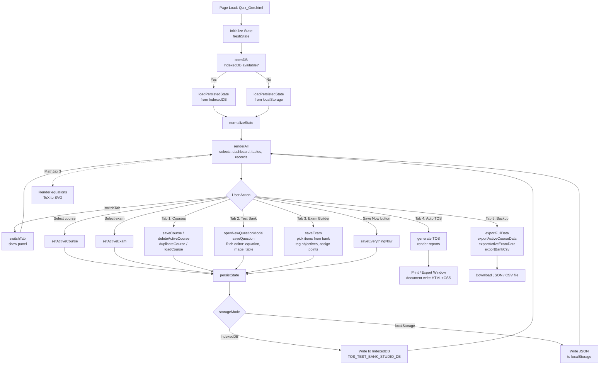

# FEU Manila IABF Quiz Gen

**TOS Generator + Course Test Bank** — a single-file, browser-based Assessment Blueprint Studio for the Far Eastern University (FEU) Manila Institute of Accounts, Business and Finance (IABF).

Build a per-course question bank, assemble exams from that bank, tag each selected item to exam objectives, and auto-generate a Table of Specifications (TOS).

---

## Features

- **Course records** — one test bank per course (code, title, units, program, faculty, notes).
- **Test bank** — MCQ and True/False items with a rich editor (equations via MathJax, images, tables, bold/italic), Bloom-level tagging, chapter/topic grouping, difficulty, status (Ready / Draft / Retired).
- **Exam builder** — pick items from the active course's bank, tag each to exam objectives, set point values.
- **Auto TOS & Reports** — Table of Specifications generated from the assembled exam, plus printable reports.
- **Backup & export** — full JSON export, per-course or per-exam export, CSV export of the test bank.
- **Local-first persistence** — IndexedDB primary, `localStorage` fallback. No server required.
- **Math rendering** — MathJax 3 (TeX → SVG) for equations.

---

## Getting Started

This is a **single HTML file**. No build step, no dependencies to install.

1. Download `Quiz_Gen.html`.
2. Open it directly in a modern browser (Chrome, Edge, Firefox, Safari).
3. Create a course → add questions → build an exam → view the auto TOS.

> Data is stored in **your browser** (IndexedDB / localStorage). Export JSON backups regularly if you switch devices, clear browser data, or work on shared lab computers.

---

## App Structure (Tabs)

| # | Tab | Purpose |
|---|-----|---------|
| 1 | **Courses** | Create / edit / delete course records. |
| 2 | **Test Bank** | Author MCQ and True/False items for the active course. |
| 3 | **Exam Builder** | Pick items from the bank, tag objectives, assign points. |
| 4 | **Auto TOS & Reports** | Generated Table of Specifications and printable reports. |
| 5 | **Backup** | Export / import full app data or per-course / per-exam slices. |

---

## How the HTML Script Works

The diagram below traces the script flow from page load through user interaction to persistence.



### Key modules in the script

- **State shape** — `state = { courses, questions, exams, ui }`. The single in-memory object is the source of truth.
- **Persistence** — `openDB`, `loadPersistedState`, `persistState`, `saveEverythingNow`. IndexedDB first; falls back to `localStorage` if unavailable.
- **Rendering** — `renderAll` fans out to `renderSelects`, `renderDashboard`, `renderCourseTable`, `renderRecordList`, and the per-tab renderers. Called after every state mutation.
- **CRUD** — `saveCourse`, `saveQuestion`, `saveExam`, `deleteActiveCourse`, `duplicateCourse`, etc. Each mutates `state`, then calls `persistState()` and `renderAll()`.
- **Export** — `exportFullData`, `exportActiveCourseData`, `exportActiveExamData`, `exportBankCsv` serialize `state` (or a slice) and trigger a download.
- **Reports / Print** — generated panels are written into a popup window via `document.write` with inline CSS for clean printing.
- **Math** — MathJax 3 (`tex-svg.js`, loaded from jsDelivr) renders LaTeX inside question stems and options.

---

## Data Persistence

| Layer | Used For | Notes |
|-------|----------|-------|
| **IndexedDB** (`TOS_TEST_BANK_STUDIO_DB`) | Primary store for the full `state` object | Default when supported. |
| **localStorage** | Fallback when IndexedDB is unavailable | Same shape; JSON-serialized. |
| **JSON / CSV export** | Off-device backup | Use **Tab 5: Backup** before switching machines or clearing browser data. |

---

## Browser Support

Any modern evergreen browser with IndexedDB and `contenteditable` support. Tested for Chrome / Edge / Firefox on desktop.

---

## File Layout

```
FEU_Manila_IABF_Quiz_Gen/
└── Quiz_Gen.html   # Entire app: HTML + CSS + JS in one file
```

---

## License

Add a license of your choice (MIT is a common default for tools like this).
